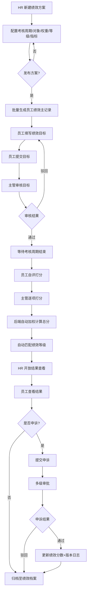
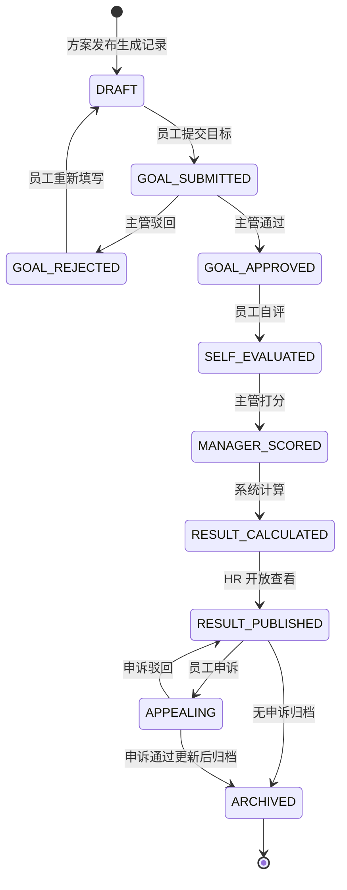
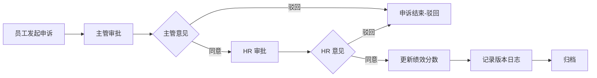
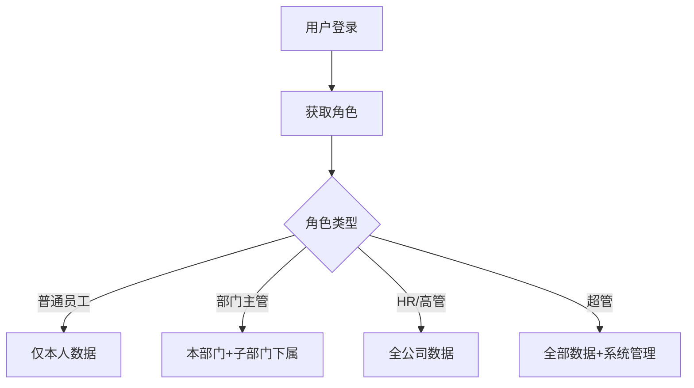

# 业务流程图

> 使用 Mermaid 语法绘制，可在支持 Mermaid 的 Markdown 查看器中渲染。

## 1. 绩效考核主流程

```mermaid
flowchart TD
    A[HR 新建绩效方案] --> B[配置考核周期/对象/权重/等级/指标]
    B --> C{发布方案?}
    C -->|否| B
    C -->|是| D[批量生成员工绩效主记录]
    D --> E[员工填写绩效目标]
    E --> F[员工提交目标]
    F --> G[主管审核目标]
    G --> H{审核结果}
    H -->|驳回| E
    H -->|通过| I[等待考核周期结束]
    I --> J[员工自评打分]
    J --> K[主管逐项打分]
    K --> L[后端自动加权计算总分]
    L --> M[自动匹配绩效等级]
    M --> N[HR 开放结果查看]
    N --> O[员工查看结果]
    O --> P{是否申诉?}
    P -->|否| Z[归档至绩效档案]
    P -->|是| Q[提交申诉]
    Q --> R[多级审批]
    R --> S{申诉结果}
    S -->|通过| T[更新绩效分数+版本日志]
    S -->|驳回| Z
    T --> Z
```

## 2. 绩效状态机

```mermaid
stateDiagram-v2
    [*] --> DRAFT: 方案发布生成记录
    DRAFT --> GOAL_SUBMITTED: 员工提交目标
    GOAL_SUBMITTED --> GOAL_REJECTED: 主管驳回
    GOAL_REJECTED --> DRAFT: 员工重新填写
    GOAL_SUBMITTED --> GOAL_APPROVED: 主管通过
    GOAL_APPROVED --> SELF_EVALUATED: 员工自评
    SELF_EVALUATED --> MANAGER_SCORED: 主管打分
    MANAGER_SCORED --> RESULT_CALCULATED: 系统计算
    RESULT_CALCULATED --> RESULT_PUBLISHED: HR 开放查看
    RESULT_PUBLISHED --> APPEALING: 员工申诉
    RESULT_PUBLISHED --> ARCHIVED: 无申诉归档
    APPEALING --> RESULT_PUBLISHED: 申诉驳回
    APPEALING --> ARCHIVED: 申诉通过更新后归档
    ARCHIVED --> [*]
```

## 3. 绩效申诉流程

```mermaid
flowchart LR
    A[员工发起申诉] --> B[主管审批]
    B --> C{主管意见}
    C -->|同意| D[HR 审批]
    C -->|驳回| E[申诉结束-驳回]
    D --> F{HR 意见}
    F -->|同意| G[更新绩效分数]
    G --> H[记录版本日志]
    F -->|驳回| E
    H --> I[归档]
```

## 4. 数据权限流转

```mermaid
flowchart TD
    A[用户登录] --> B[获取角色]
    B --> C{角色类型}
    C -->|普通员工| D[仅本人数据]
    C -->|部门主管| E[本部门+子部门下属]
    C -->|HR/高管| F[全公司数据]
    C -->|超管| G[全部数据+系统管理]
```
