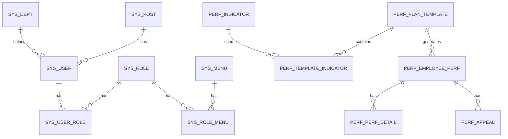

# 数据库设计文档

> 数据库：MySQL 8.0  |  字符集：utf8mb4

## 1. ER 关系概览

## 2. 表结构明细

### 2.1 sys_dept（部门表）

| 字段 | 类型 | 说明 |
|------|------|------|
| id | bigint PK | 主键 |
| parent_id | bigint | 父部门ID，0为顶级 |
| dept_name | varchar(50) | 部门名称 |
| order_num | int | 排序 |
| leader | varchar(50) | 负责人 |
| phone | varchar(20) | 联系电话 |
| email | varchar(50) | 邮箱 |
| status | tinyint | 状态 0正常 1停用 |
| create_time | datetime | 创建时间 |
| update_time | datetime | 更新时间 |

### 2.2 sys_user（员工用户表）

| 字段 | 类型 | 说明 |
|------|------|------|
| id | bigint PK | 主键 |
| dept_id | bigint | 部门ID |
| post_id | bigint | 岗位ID |
| username | varchar(50) UNIQUE | 登录账号 |
| password | varchar(100) | 密码(BCrypt) |
| real_name | varchar(50) | 真实姓名 |
| gender | tinyint | 性别 0男 1女 |
| phone | varchar(20) | 手机号 |
| email | varchar(50) | 邮箱 |
| leader_id | bigint | 直属主管ID |
| status | tinyint | 状态 0正常 1停用 |
| create_time | datetime | 创建时间 |
| update_time | datetime | 更新时间 |

### 2.3 sys_post（岗位表）

| 字段 | 类型 | 说明 |
|------|------|------|
| id | bigint PK | 主键 |
| post_name | varchar(50) | 岗位名称 |
| post_code | varchar(50) | 岗位编码 |
| order_num | int | 排序 |
| status | tinyint | 状态 |
| create_time | datetime | 创建时间 |

### 2.4 sys_role（角色表）

| 字段 | 类型 | 说明 |
|------|------|------|
| id | bigint PK | 主键 |
| role_name | varchar(50) | 角色名称 |
| role_code | varchar(50) UNIQUE | 角色编码 |
| data_scope | tinyint | 数据权限 1全部 2本部门 3本部门及以下 4仅本人 |
| status | tinyint | 状态 |
| create_time | datetime | 创建时间 |

### 2.5 sys_menu（菜单表）

| 字段 | 类型 | 说明 |
|------|------|------|
| id | bigint PK | 主键 |
| parent_id | bigint | 父菜单ID |
| menu_name | varchar(50) | 菜单名称 |
| path | varchar(200) | 路由路径 |
| component | varchar(200) | 组件路径 |
| perms | varchar(100) | 权限标识 |
| icon | varchar(50) | 图标 |
| order_num | int | 排序 |
| menu_type | tinyint | 类型 1目录 2菜单 3按钮 |

### 2.6 sys_user_role / sys_role_menu

| 字段 | 类型 | 说明 |
|------|------|------|
| id | bigint PK | 主键 |
| user_id/role_id | bigint | 用户/角色ID |
| role_id/menu_id | bigint | 角色/菜单ID |

### 2.7 sys_dict（通用字典）

| 字段 | 类型 | 说明 |
|------|------|------|
| id | bigint PK | 主键 |
| dict_type | varchar(50) | 字典类型 |
| dict_label | varchar(100) | 字典标签 |
| dict_value | varchar(100) | 字典值 |
| order_num | int | 排序 |
| status | tinyint | 状态 |

### 2.8 perf_indicator（绩效指标库）

| 字段 | 类型 | 说明 |
|------|------|------|
| id | bigint PK | 主键 |
| indicator_name | varchar(100) | 指标名称 |
| indicator_type | varchar(20) | 分类 KPI/GS/ABILITY/ATTITUDE |
| post_id | bigint | 绑定岗位ID |
| description | varchar(500) | 指标说明 |
| max_score | decimal(5,2) | 满分 |
| status | tinyint | 状态 |
| create_time | datetime | 创建时间 |

### 2.9 perf_plan_template（绩效方案模板）

| 字段 | 类型 | 说明 |
|------|------|------|
| id | bigint PK | 主键 |
| template_name | varchar(100) | 方案名称 |
| cycle_type | varchar(20) | 考核周期 MONTHLY/QUARTERLY/YEARLY |
| cycle_start | date | 周期开始 |
| cycle_end | date | 周期结束 |
| self_weight | decimal(3,2) | 自评权重 |
| manager_weight | decimal(3,2) | 主管权重 |
| grade_a_min | decimal(5,2) | A等最低分 |
| grade_b_min | decimal(5,2) | B等最低分 |
| grade_c_min | decimal(5,2) | C等最低分 |
| status | tinyint | 状态 0草稿 1已发布 2已归档 |
| create_time | datetime | 创建时间 |
| publish_time | datetime | 发布时间 |

### 2.10 perf_template_indicator（方案指标关联）

| 字段 | 类型 | 说明 |
|------|------|------|
| id | bigint PK | 主键 |
| template_id | bigint | 方案ID |
| indicator_id | bigint | 指标ID |
| weight | decimal(3,2) | 指标权重 |

### 2.11 perf_employee_perf（员工单次绩效主表）

| 字段 | 类型 | 说明 |
|------|------|------|
| id | bigint PK | 主键 |
| template_id | bigint | 方案ID |
| user_id | bigint | 员工ID |
| dept_id | bigint | 部门ID |
| status | varchar(20) | 状态(见状态机) |
| self_score | decimal(5,2) | 自评总分 |
| manager_score | decimal(5,2) | 主管总分 |
| final_score | decimal(5,2) | 最终得分 |
| grade | varchar(5) | 绩效等级 A/B/C/D |
| goal_review_comment | varchar(500) | 目标审核意见 |
| result_published | tinyint | 结果是否开放 |
| create_time | datetime | 创建时间 |
| update_time | datetime | 更新时间 |

### 2.12 perf_perf_detail（指标打分明细）

| 字段 | 类型 | 说明 |
|------|------|------|
| id | bigint PK | 主键 |
| perf_id | bigint | 绩效主表ID |
| indicator_id | bigint | 指标ID |
| indicator_name | varchar(100) | 指标名称(冗余) |
| weight | decimal(3,2) | 指标权重 |
| self_score | decimal(5,2) | 自评分 |
| manager_score | decimal(5,2) | 主管分 |
| self_comment | varchar(500) | 自评评语 |
| manager_comment | varchar(500) | 主管评语 |

### 2.13 perf_appeal（绩效申诉表）

| 字段 | 类型 | 说明 |
|------|------|------|
| id | bigint PK | 主键 |
| perf_id | bigint | 绩效主表ID |
| user_id | bigint | 申诉人ID |
| reason | varchar(500) | 申诉理由 |
| attachment | varchar(500) | 附件路径 |
| status | varchar(20) | PENDING/MANAGER_APPROVED/HR_APPROVED/REJECTED |
| manager_comment | varchar(500) | 主管意见 |
| hr_comment | varchar(500) | HR意见 |
| adjusted_score | decimal(5,2) | 调整后分数 |
| create_time | datetime | 创建时间 |

### 2.14 perf_appeal_log（申诉版本日志）

| 字段 | 类型 | 说明 |
|------|------|------|
| id | bigint PK | 主键 |
| appeal_id | bigint | 申诉ID |
| perf_id | bigint | 绩效ID |
| before_score | decimal(5,2) | 变更前分数 |
| after_score | decimal(5,2) | 变更后分数 |
| operator | bigint | 操作人 |
| create_time | datetime | 操作时间 |

## 3. 索引设计

- `sys_user`: idx_dept_id, idx_username
- `perf_employee_perf`: idx_template_id, idx_user_id, idx_dept_id, idx_status
- `perf_perf_detail`: idx_perf_id
- `perf_appeal`: idx_perf_id, idx_user_id

## 4. 数据字典

| 字典类型 | 说明 | 值 |
|----------|------|-----|
| indicator_type | 指标分类 | KPI/GS/ABILITY/ATTITUDE |
| cycle_type | 考核周期 | MONTHLY/QUARTERLY/YEARLY |
| perf_status | 绩效状态 | DRAFT/GOAL_SUBMITTED/... |
| grade | 绩效等级 | A/B/C/D |
