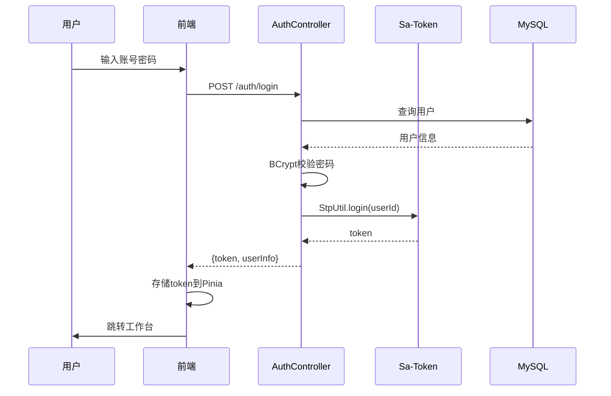
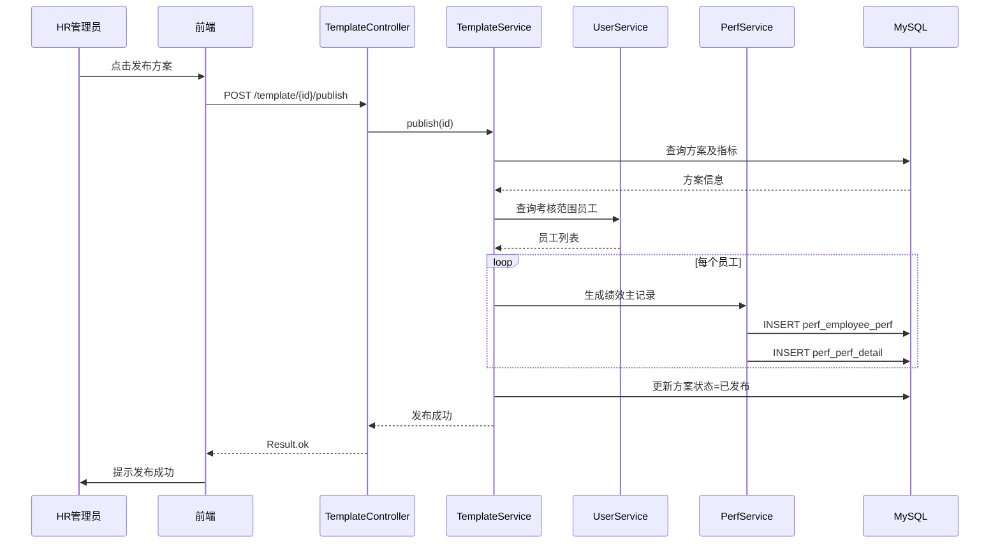
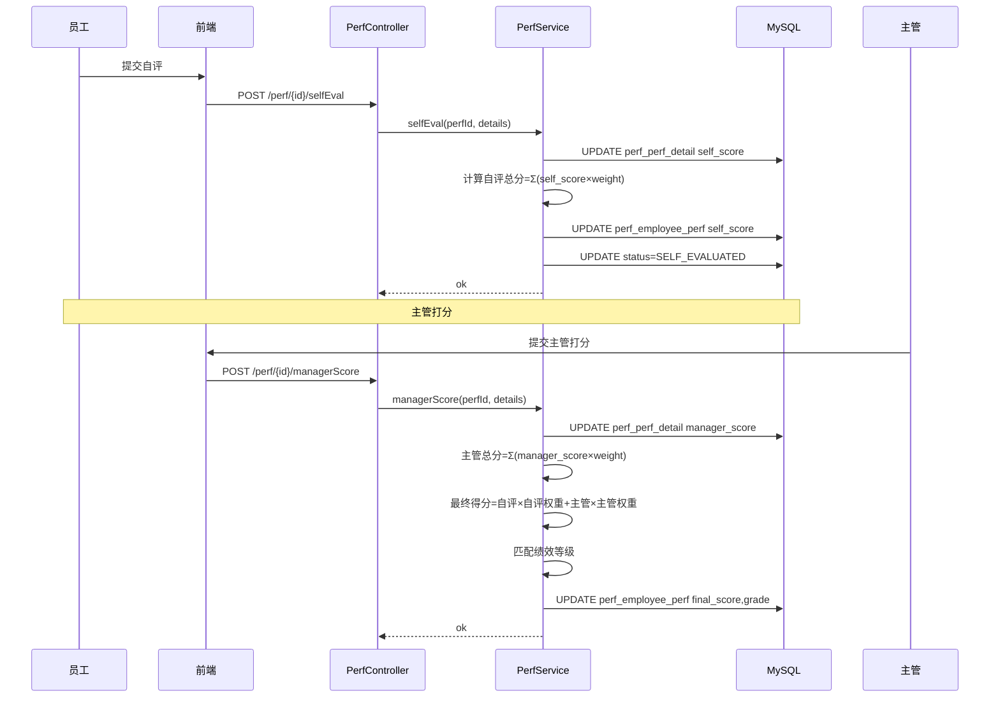
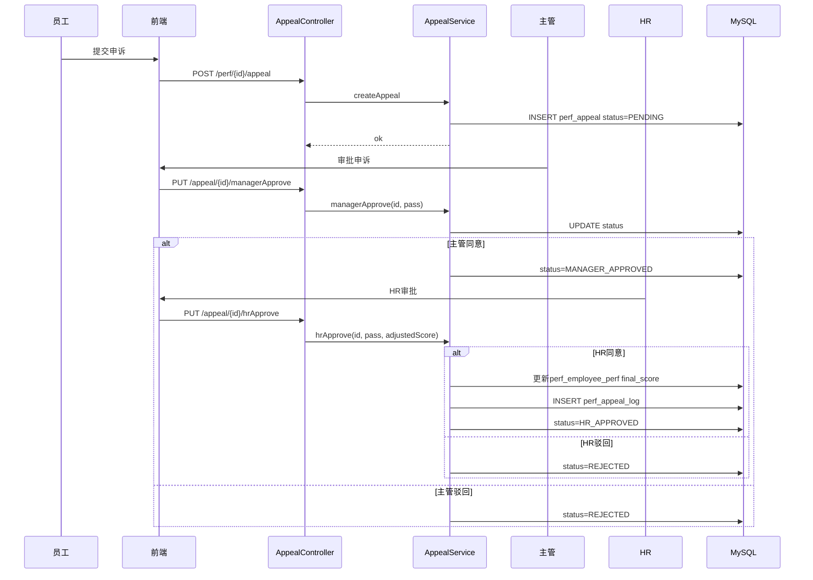
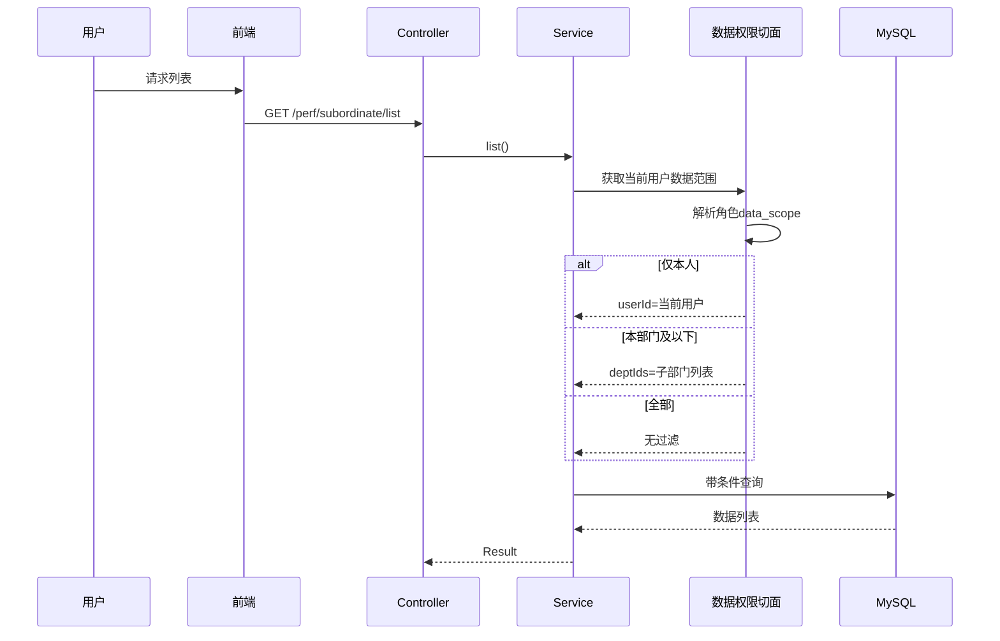

# 时序图

## 1. 登录鉴权时序

```mermaid
sequenceDiagram
    participant U as 用户
    participant F as 前端
    participant A as AuthController
    participant S as Sa-Token
    participant DB as MySQL
    U->>F: 输入账号密码
    F->>A: POST /auth/login
    A->>DB: 查询用户
    DB-->>A: 用户信息
    A->>A: BCrypt校验密码
    A->>S: StpUtil.login(userId)
    S-->>A: token
    A-->>F: {token, userInfo}
    F->>F: 存储token到Pinia
    F->>U: 跳转工作台
```

## 2. 绩效方案发布时序

```mermaid
sequenceDiagram
    participant HR as HR管理员
    participant F as 前端
    participant TC as TemplateController
    participant TS as TemplateService
    participant US as UserService
    participant PS as PerfService
    participant DB as MySQL
    HR->>F: 点击发布方案
    F->>TC: POST /template/{id}/publish
    TC->>TS: publish(id)
    TS->>DB: 查询方案及指标
    DB-->>TS: 方案信息
    TS->>US: 查询考核范围员工
    US-->>TS: 员工列表
    loop 每个员工
        TS->>PS: 生成绩效主记录
        PS->>DB: INSERT perf_employee_perf
        PS->>DB: INSERT perf_perf_detail
    end
    TS->>DB: 更新方案状态=已发布
    TS-->>TC: 发布成功
    TC-->>F: Result.ok
    F->>HR: 提示发布成功
```

## 3. 绩效打分与计算时序

```mermaid
sequenceDiagram
    participant E as 员工
    participant F as 前端
    participant PC as PerfController
    participant PS as PerfService
    participant DB as MySQL
    E->>F: 提交自评
    F->>PC: POST /perf/{id}/selfEval
    PC->>PS: selfEval(perfId, details)
    PS->>DB: UPDATE perf_perf_detail self_score
    PS->>PS: 计算自评总分=Σ(self_score×weight)
    PS->>DB: UPDATE perf_employee_perf self_score
    PS->>DB: UPDATE status=SELF_EVALUATED
    PS-->>PC: ok
    Note over E,DB: 主管打分
    participant M as 主管
    M->>F: 提交主管打分
    F->>PC: POST /perf/{id}/managerScore
    PC->>PS: managerScore(perfId, details)
    PS->>DB: UPDATE perf_perf_detail manager_score
    PS->>PS: 主管总分=Σ(manager_score×weight)
    PS->>PS: 最终得分=自评×自评权重+主管×主管权重
    PS->>PS: 匹配绩效等级
    PS->>DB: UPDATE perf_employee_perf final_score,grade
    PS-->>PC: ok
```

## 4. 绩效申诉审批时序

```mermaid
sequenceDiagram
    participant E as 员工
    participant F as 前端
    participant AC as AppealController
    participant AS as AppealService
    participant M as 主管
    participant HR as HR
    participant DB as MySQL
    E->>F: 提交申诉
    F->>AC: POST /perf/{id}/appeal
    AC->>AS: createAppeal
    AS->>DB: INSERT perf_appeal status=PENDING
    AS-->>AC: ok
    M->>F: 审批申诉
    F->>AC: PUT /appeal/{id}/managerApprove
    AC->>AS: managerApprove(id, pass)
    AS->>DB: UPDATE status
    alt 主管同意
        AS->>DB: status=MANAGER_APPROVED
        HR->>F: HR审批
        F->>AC: PUT /appeal/{id}/hrApprove
        AC->>AS: hrApprove(id, pass, adjustedScore)
        alt HR同意
            AS->>DB: 更新perf_employee_perf final_score
            AS->>DB: INSERT perf_appeal_log
            AS->>DB: status=HR_APPROVED
        else HR驳回
            AS->>DB: status=REJECTED
        end
    else 主管驳回
        AS->>DB: status=REJECTED
    end
```

## 5. 数据权限过滤时序

```mermaid
sequenceDiagram
    participant U as 用户
    participant F as 前端
    participant C as Controller
    participant S as Service
    participant P as 数据权限切面
    participant DB as MySQL
    U->>F: 请求列表
    F->>C: GET /perf/subordinate/list
    C->>S: list()
    S->>P: 获取当前用户数据范围
    P->>P: 解析角色data_scope
    alt 仅本人
        P-->>S: userId=当前用户
    else 本部门及以下
        P-->>S: deptIds=子部门列表
    else 全部
        P-->>S: 无过滤
    end
    S->>DB: 带条件查询
    DB-->>S: 数据列表
    S-->>C: Result
```
