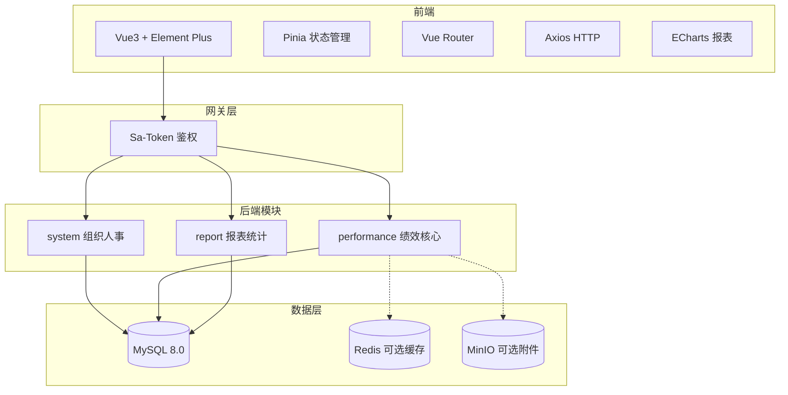

# 架构文档

## 1. 总体架构

本系统采用**模块化单体架构**，按业务领域划分模块，模块间通过接口调用，便于未来拆分为微服务。



## 2. 模块划分

| 模块 | 包名 | 职责 |
|------|------|------|
| common | com.perf.common | 通用工具、统一返回、异常、常量 |
| system | com.perf.system | 部门、用户、岗位、角色、菜单、字典 |
| performance | com.perf.performance | 指标库、方案、计划、评估、结果、申诉、档案 |
| report | com.perf.report | 可视化报表统计 |

## 3. 分层架构

```
Controller（接口层）  →  Service（业务层）  →  Mapper（数据层）
     ↓                       ↓                      ↓
  接收请求/参数校验      业务逻辑/事务          MyBatis-Plus
```

## 4. 技术选型说明

| 技术 | 版本 | 用途 |
|------|------|------|
| Spring Boot | 2.7.x | 后端框架 |
| MyBatis-Plus | 3.5.x | ORM |
| Sa-Token | 1.37.x | 权限认证 |
| MySQL | 8.0 | 数据库 |
| Redis | 可选 | 字典/周期缓存 |
| MinIO | 可选 | 附件存储 |
| Vue | 3.x | 前端框架 |
| Element Plus | 2.x | UI 组件 |
| Pinia | 2.x | 状态管理 |
| ECharts | 5.x | 图表 |

## 5. 安全设计

- **认证**：Sa-Token 登录态，Token 存储于请求头。
- **授权**：注解 `@SaCheckPermission` 校验菜单权限。
- **数据权限**：Service 层根据角色过滤数据范围。
- **密码**：BCrypt 加密存储。
- **SQL 注入**：MyBatis-Plus 参数化查询。

## 6. 部署架构

```
[Nginx 前端静态资源]  →  [Spring Boot Jar]  →  [MySQL]
                                          →  [Redis]
                                          →  [MinIO]
```

## 7. 扩展性

- 模块化单体，模块间低耦合。
- 未来可将 `performance`、`report` 拆分为独立微服务。
- 通过 Nacos + OpenFeign 可平滑迁移到微服务架构。
